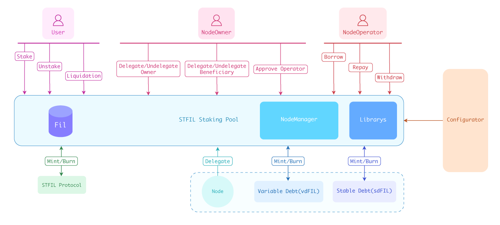

# Introduction

### What is STFIL？
STFIL is a decentralised non-custodial liquidity market protocol where users can participate as suppliers and storage providers can borrowers.  Suppliers provide liquidity to the market to earn a passive income, while storage providers are able to borrow in an overcollateralised (perpetually).
Please join the [STFIL community Slack server](https://filecoinproject.slack.com/archives/C0512AMBV98);  the STFIL team and members of the community look forward to helping you understand and use STFIL.

The protocol is implemented as a set of smart contracts on top of the Filecoin blockchain. Smart contracts guarantee safety and do not require a middleman. 

:::info
A detailed and technical description can be found in the [whitepaper](https://docs.stfil.io/STFIL_Protocol_Whitepaper_v1_1.pdf).
:::