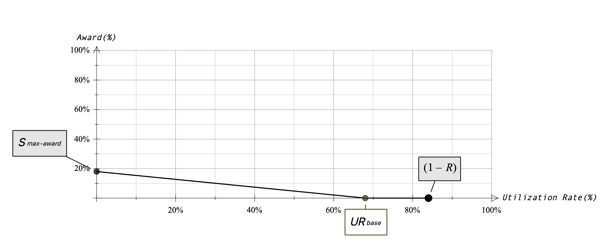

# 经济模型

STFIL 协议将用户的质押的资金提供给精心挑选的存储提供商进行代币质押，获得的收益重新铸造stFIL，再分给用户，用户可以在存款后的 24 小时内收到质押奖励，而无需等待验证器激活。那么如何分配收益，成为所有参与者最关心的内容。

在STFIL的经济模型中，扣除平台一小部分服务费后，存储提供商最终的收益比例数学公式: _Sfinal_，它由两部分组成，分别是基础收益分成数学公式: _Sbase_，和鼓励分成数学公式: _Saward_ 即持币人收益的一部分:

$$ _Sfinal_ = _Sbase_ + ( 1 - _Sbase_ ) × _Saward_ $$

### 基础收益

对于存储提供商来说，在本协议中，将质押的FIL为单位计算付出的成本，以美元计价，包含服务器费用、IDC成本、gas消耗、人员维护成本。记 数学公式: _Csp_ 为存储提供商单位成本，在市场供求正常情况下较稳定，由 STFIL DAO 提案调整。资金持有人的成本数学公式: _Cassets_ ，即当前FIL相对于USDT的价格，由预言机喂加来维持STFIL协议中的价格始终于和市场保持一致。

准寻投入比例即收益的比例，得出存储提供商获得一笔质押，要付出收益的数学公式: _Sbase_ 份额给协议，用来作为持币人的收益：

$$ _Sbase_ = \frac{_Csp_}{_Csp_ + _Cassets_} $$

若 $ _Csp_ = 7 _usdt_ $ 时，那么在不同的FIL价格下波动：

### 鼓励

该协议本质是通过DeFi的能力来提高资本效率和效用性，但是如果任由STFIL流动性池不间断的吸引了大量的TVL（Total Value Locked），但大部分资金并未被利用，也不会得到满意的效果。所以协议设置了鼓励分成数学公式: _Saward_ ，表示持币人愿意出让一部分收益，用来推进存储提供商充分的利用协议内的资金，给自己带来更多更稳定的收益。

记 数学公式: _URbase_ 为资金利用率的基准线，当资金的利用率不足数学公式: _URbase_ 时，发起数学公式: _Smax-award_ 的最大鼓励分成，斜率由两者共同决定，那么当前的鼓励分成为：

$$ _Scurrent_ = \frac{ _Smax-award_ }{ _URbase_ } × _Scurrent_  + _Smax-award_ $$

每一次的贷款，都有当前的鼓励分成数学公式: $ _Scurrent_ $ 和贷款后的鼓励分成数学公式: $ _Safter_ $ ，最终的奖励分成由两者的平均数决定：

$$ _Saward_ = \frac{ _Scurrent_ + _Safter_ }{2} $$

当金库余额太少，金库的流动性不足，会造成市场的恐慌。为了解决这个问题，协议设置存储准备金率数学公式: $ R $,这部分资金将不接受给存储提供商用于质押。

暂停贷款的条件：

$$ _Scurrent_ \geq 1-R $$

金库的最佳状态：

$$  _URbase_ \leq _URcurrent_ \leq 1-R $$

若数学公式: $ _Saward_  $= 20% ，数学公式: $ _URbase_ $= 70%则：

### 稳定债务&可变债务

对于存储提供商来说，可以根据自己的实际情况选择不同的债务模式，如果选择稳定债务模式，那么将使用资金的整个周期中，都将按照当前的分成比例，不再发生变化。如果选择可变债务，鼓励分成数学公式: $ {S_{award}} $始终保持不变，基础分成数学公式: $ {S_{sp}} $随市场的FIL价格波动而波动，在任何时候都不会存在入不敷出的情况，更能抗击风险。
在下一次贷款的时候，可以改变债务模式，以最后一次选择的为准。
