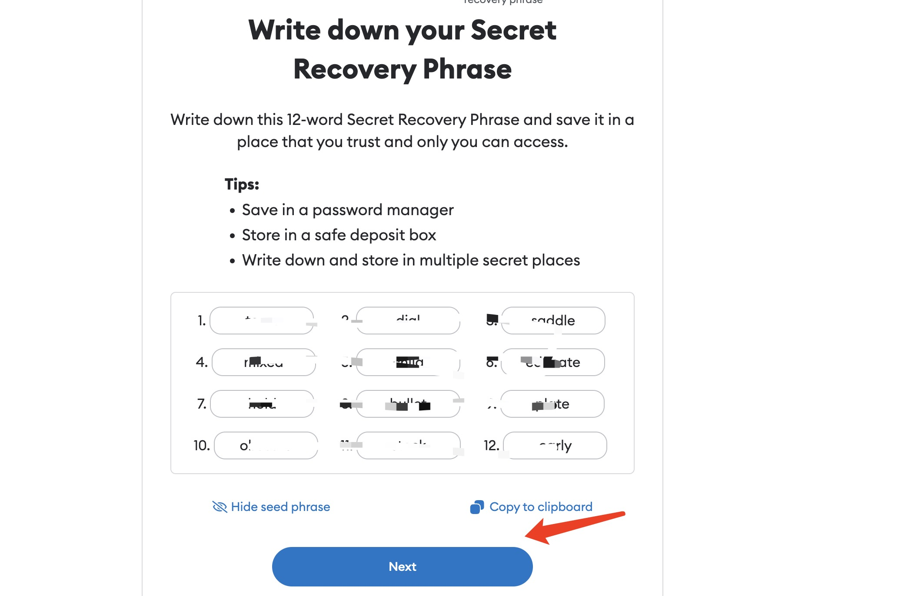

# Set 0x/f4 wallet

How to set the 0x/f4 wallet address, using MetaMask as an example.

## Phone Usage

### Install MetaMask IOS App

IOS Download Link: **https://metamask.io**

Note that appstore accounts in mainland China cannot download MetaMask, and it is recommended to use appstore accounts in the United States

### Install MetaMask Android App

Android Download Link: **https://github.com/MetaMask/metamask-mobile/releases/download/v6.3.0/app-prod-release.apk**

This download comes from the public release version of MetaMask [github](https://github.com/MetaMask/metamask-mobile/releases)

### Create a new wallet

### Add Filecoin network

Visit **https://app.stfil.io** in MetaMask browser

### Create a 0x/f4 wallet address when the connection is successful

## PC-Chrome Browser Usage

### Install the Metamask plugin

Open Google Chrome and search for Metamask in the [Google Web Store](https://chrome.google.com/webstore/search/metamask)

### Create a new wallet

### Add Filecoin network

Visit https://app.stfil.io in Chrome Browser

### Create a 0x/f4 wallet address when the connection is successful

