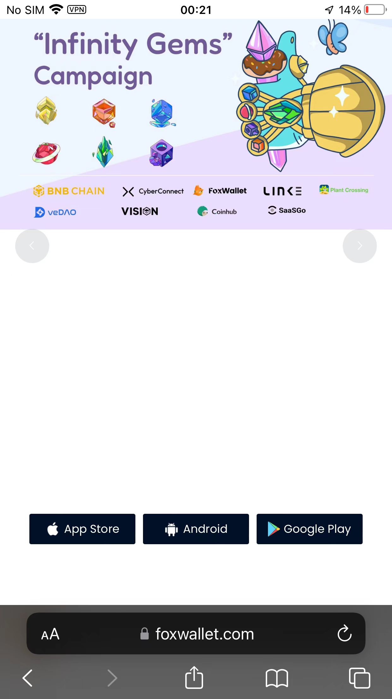
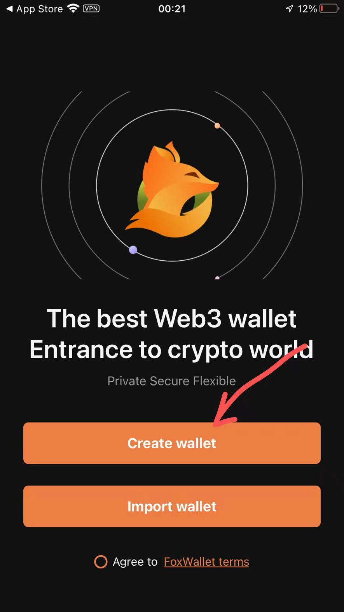
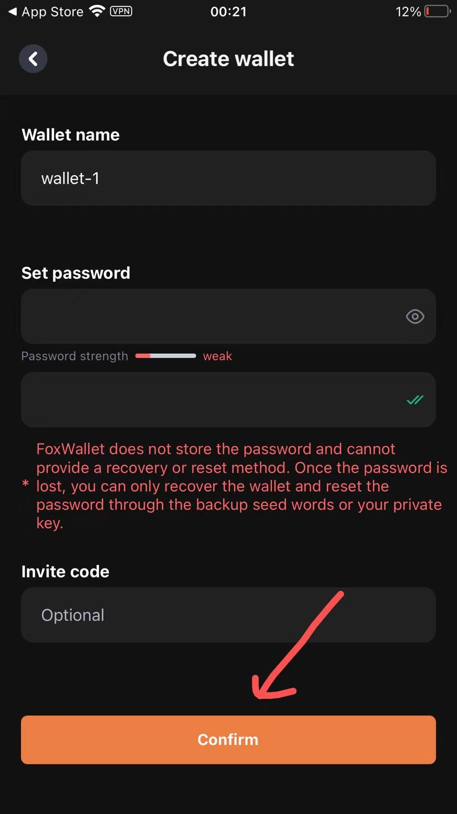
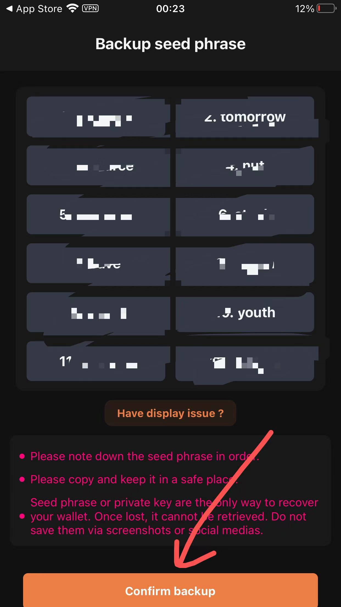
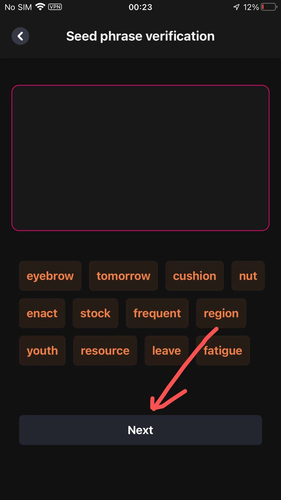
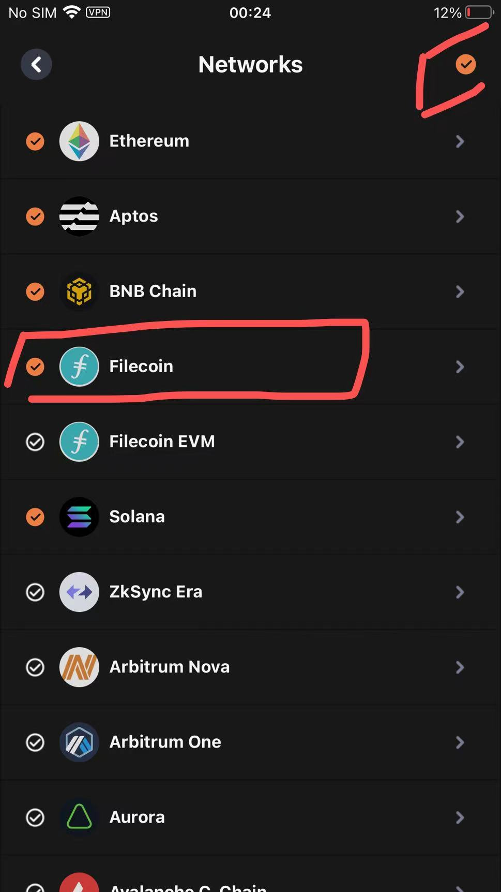
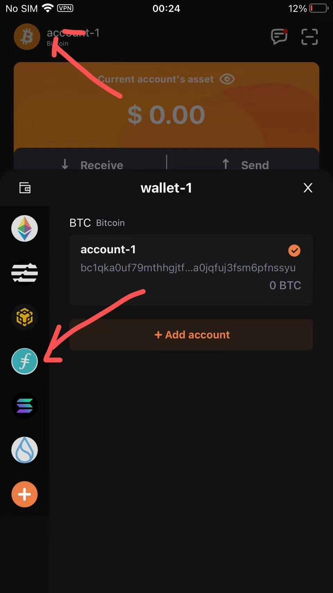
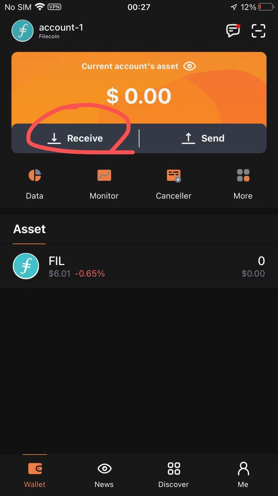
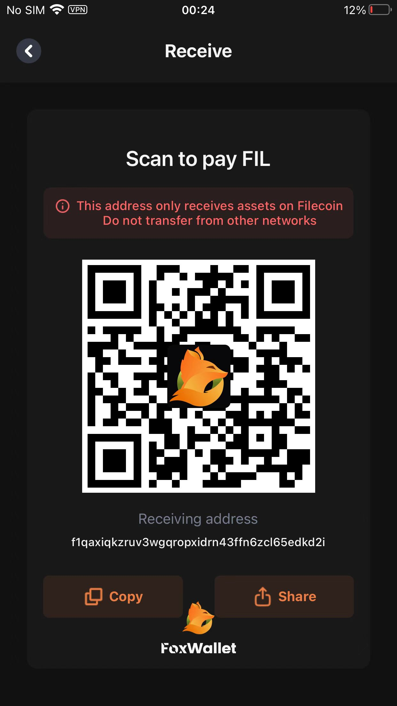
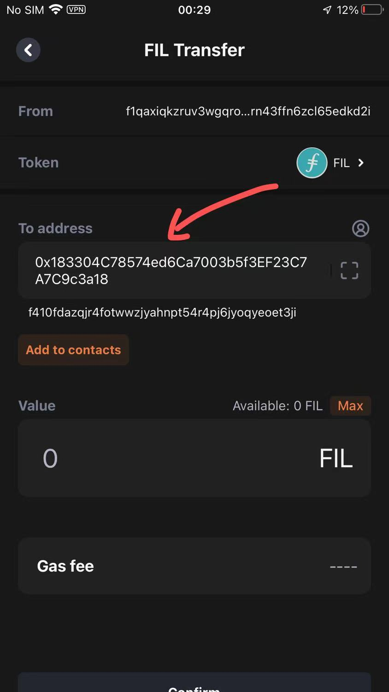

# How to transfer to 0x/f4 wallet

Introduce how to transfer from an exchange/hardware wallet that does not support 0x/f4 to a 0x/f4 wallet

## Transit using FoxWallet

### Install FoxWallet App

FoxWallet download link: **https://foxwallet.com/**

### Create a new wallet(Contains Filecoin f1 wallet address)  

### transfer from an exchange/hardware wallet that does not support 0x/f4 to FoxWallet

### Transfer from FoxWallet to MetaMask 0x/f4 wallet

## OKX exchange fully supports 0x/f4 wallet

* Transfer from exchange/hardware wallet to OKX
* Transfer from OKX to MetaMask 0x/f4 wallet

