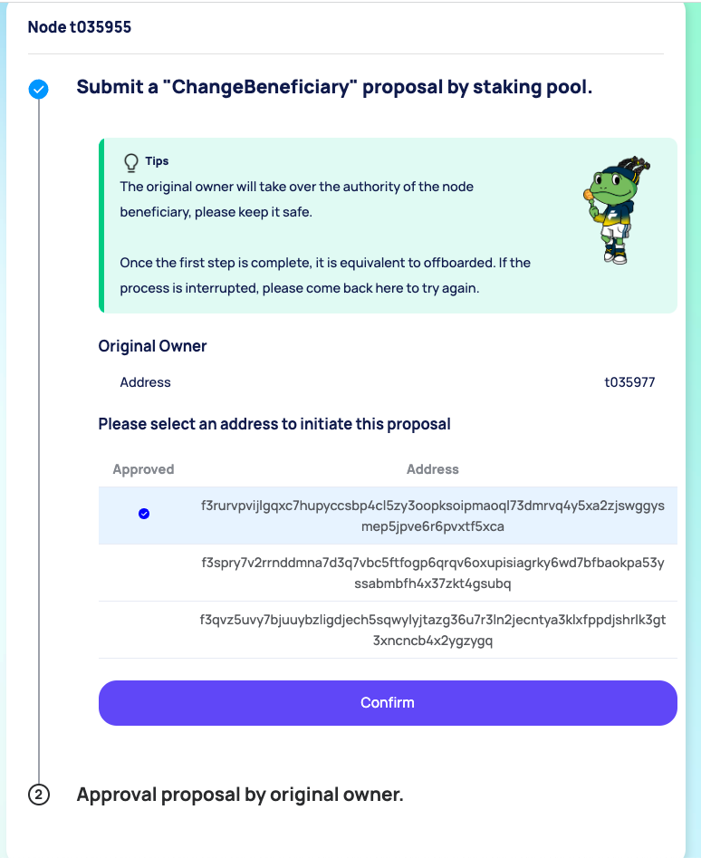
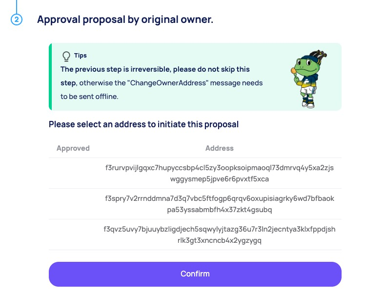

# Offboarding

**💡_ Note: Please repay all debts before leaving._**

###  Repay debts

**💡 _Note: Here, repaying debts will deduct from the available balance of the node by default._**

1. Visit the node details page. 
2. Connect your wallet and make sure your network is set to the Filecoin network. If you are not connected, click here.

3. Specify the amount to be repaid. Before leaving, please click the maximum repayment amount. 

### Offboarding

· Go to the node details page, click the '**Offboarding Now**' button to enter the offboarding page.

On the offboarding page, select your wallet to sign and return the signed result to the form. Submit a changeOwner/changeBeneficiary message through the Staking Pool, and have the old owner wallet sign it. This tutorial is for offboarding a multi-signature wallet, which requires two wallets to complete the signature operation. If it is a regular wallet, only one wallet can complete it.

After the Staking Pool submits the changeOwner/changeBeneficiary message, the old owner wallet should send a confirmation message accepting the new owner/beneficiary and sign it.

