# Onboarding

Here, we provide a step-by-step guide on how to onboarding

Click the '**Onboarding Now**' button on the '**Farm**' page to enter the onboarding process page.

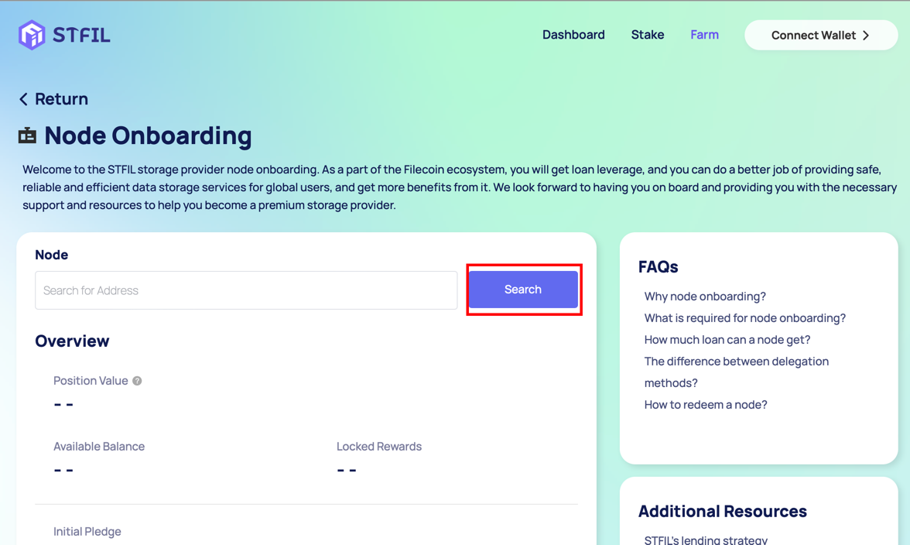

Locate your node, and after confirming its accuracy, proceed to the next step.

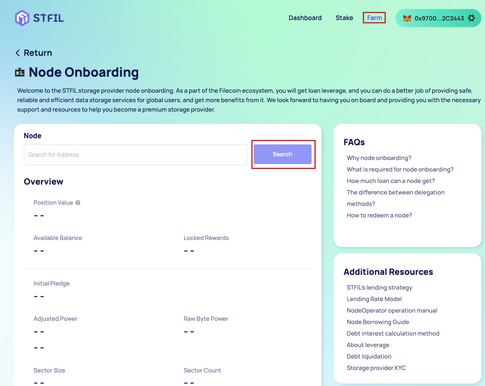

Select whether you want to delegate to the _**owner / beneficiary**_ and proceed to the delegation page. 

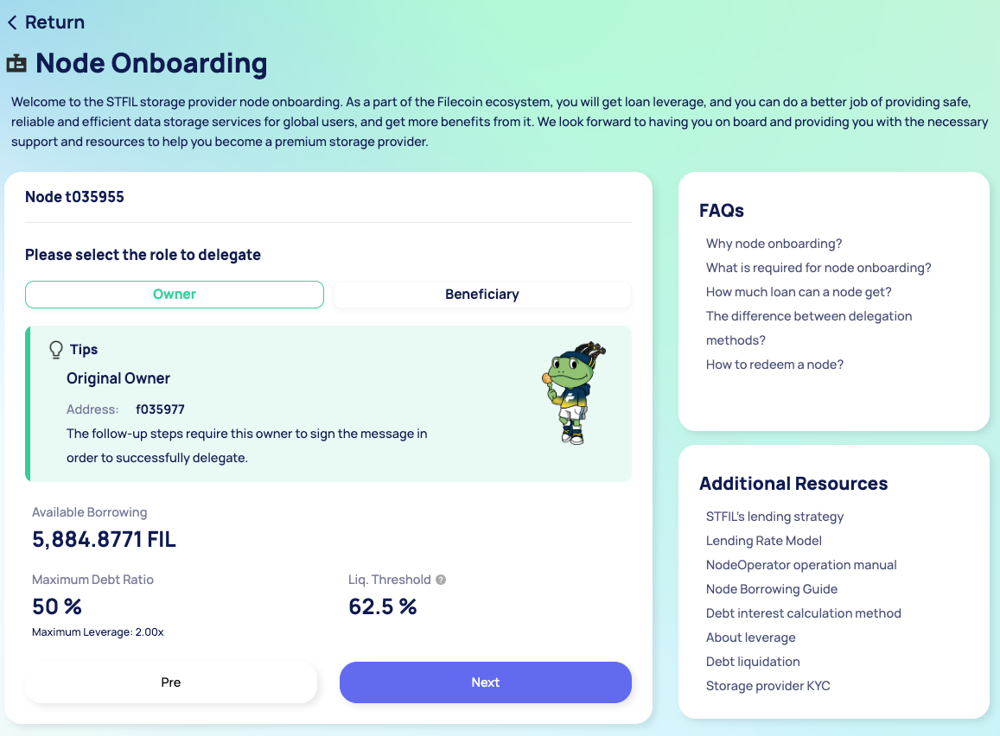

This demonstration shows the process of delegating to a beneficiary using a multi-signature wallet. If you have a regular wallet, you only need to sign for one wallet.

#### Difference in commission methods:

1. _**Delegate Owner address:**_    After joining, you can obtain a loan leverage of 2 times. After completing KYC, you can obtain a maximum loan leverage of 3 times. The prerequisite is that you need to ensure that the owner address is the same to the beneficiary address, and you own the private key of that wallet.

2. _**Delegate Beneficiary address:**_   After joining, you can obtain a loan leverage of 1.5 times. After completing KYC, you can obtain a maximum loan leverage of 2 times the assets.

💡 **Signature**: Here, you can sign using the Lotus client/FiveToken

#### Delegating to the owner/beneficiary involves two steps.

1.  The current owner initiates a ChangeOwnerAddress proposal to change the current owner/beneficiary address to the contract address of the Staking Pool.

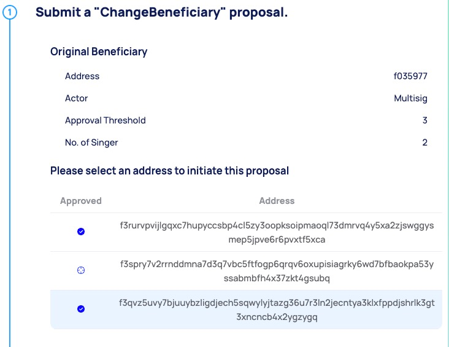

2.  The Staking Pool confirms the receipt of the owner/beneficiary address.

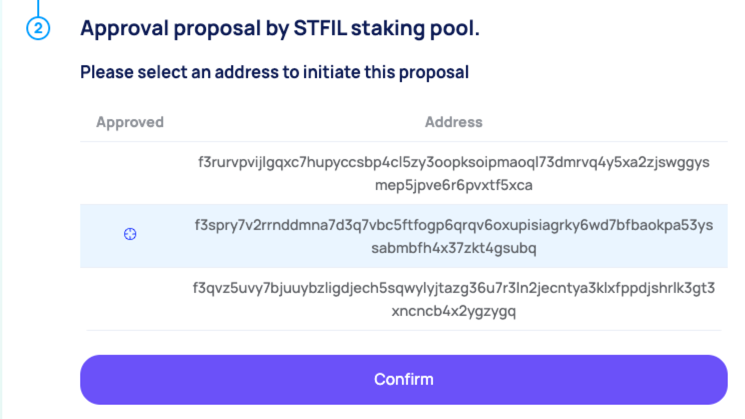

"Congratulations on successfully completing the above steps and onboarding! Please keep the original owner safe, as it is still the owner of this node. The next step is to set the node operator.

### Set the node operator

On the '**Farm**' page, find your node and click '**View**' to see its details.

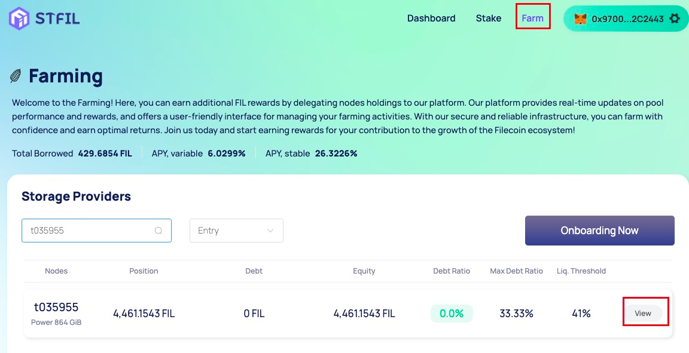

After entering the node details page, select '**Settings**'.

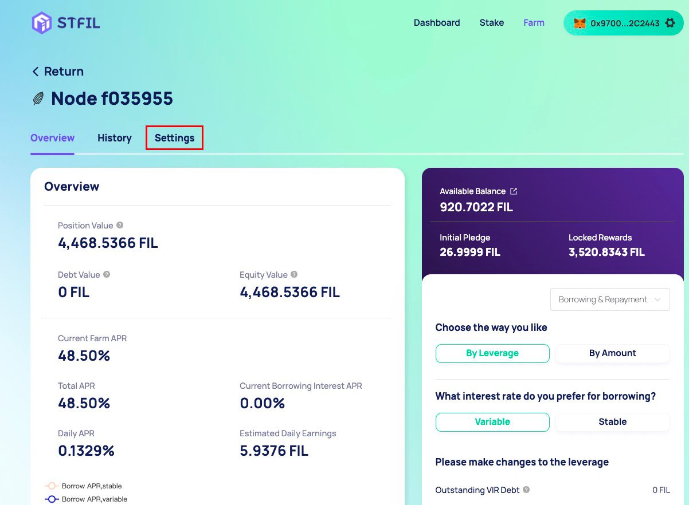

Select '**Set Operator**'.

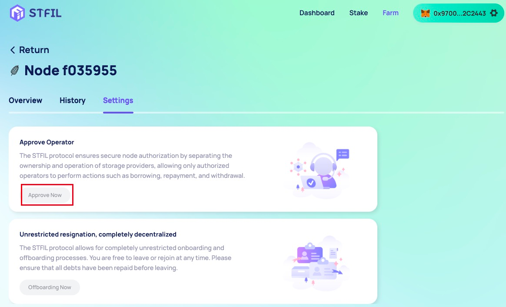

Set up your available wallet. Currently, MetaMask/WalletConnect are supported.

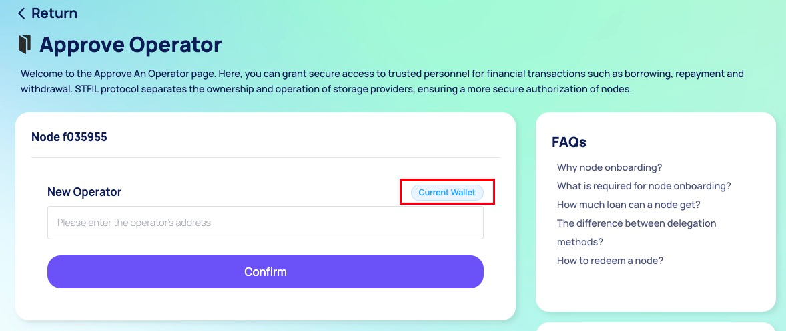

After confirming the set address, click '**Confirm**' to enter the approval phase by the original owner.

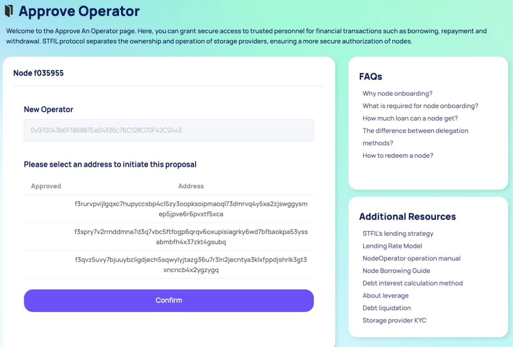

Similar to the onboarding process, if the original owner has a regular wallet, only one signature is needed. This demonstration shows the operation process of a multi-signature wallet.

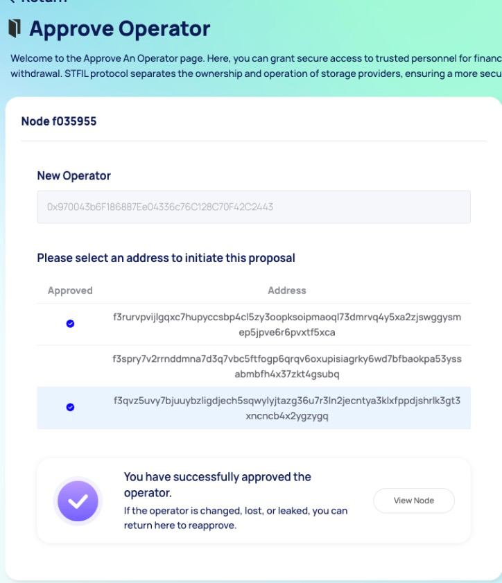

