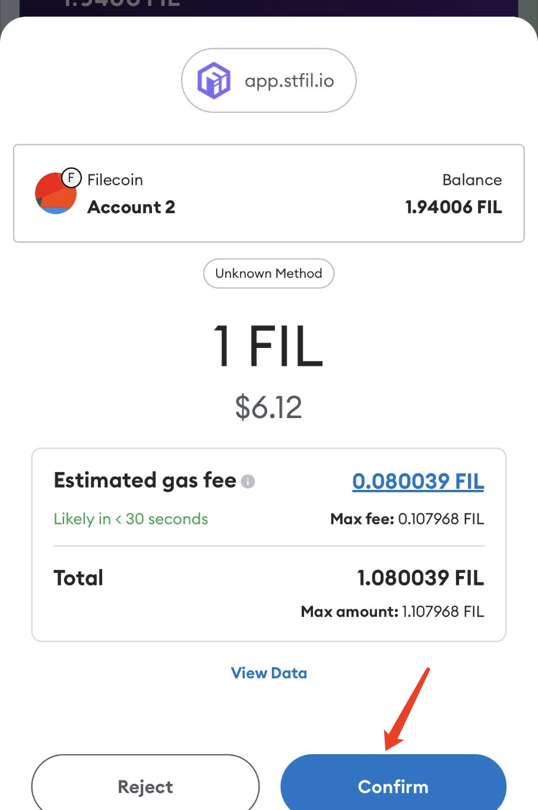

# Stake

Here, we provide a step-by-step guide on how to stake your Fil to earn maximum yield.

## Install MetaMask

** If you have already installed, you can skip this step. **

How to install: **https://docs.stfil.io/docs/guides/fevm/set0xf4wallet#phone-usage**

## Set 0x/f4 wallet

**If you have already connected to the Filecoin network and generated a corresponding 0x/f4 wallet, you can skip this step. **

How to create a new 0x/f4 wallet: **https://docs.stfil.io/docs/guides/fevm/set0xf4wallet/#add-filecoin-network**

## Transfer FIl from exchange/hardware wallet to MetaMask

Check the support of each exchange for 0x/f4 wallet: **https://docs.stfil.io/docs/guides/fevm/introduction#centralized-exchanges**

The exchange/hardware wallet held does not support 0x/f4 wallet how to transfer: **https://docs.stfil.io/docs/guides/fevm/transferto0xf4wallet**

## How to stake FIL

### Phone usage

Visit **https://app.stfil.io** in MetaMask browser

### PC-Chrome Browser Usage

Visit https://app.stfil.io in Chrome Browser

- Go to Stake page and select **STAKE** tab.
- Connect your wallet (such as MetaMask). Make sure your network is set to filecoin chain.
  Click [here]( https://docs.filecoin.io/networks/mainnet/add-to-metamask/ ) if you do not have it set up.
- Specify the amount you want to stake
- Click **STAKE**

- After clicking STAKE, you should get a pop-up notification in your MetaMask to accept the transaction.
  Click Confirm and wait for the transaction to be processed.
- Once the transaction has gone through, you should automatically receive stFil in your wallet.

