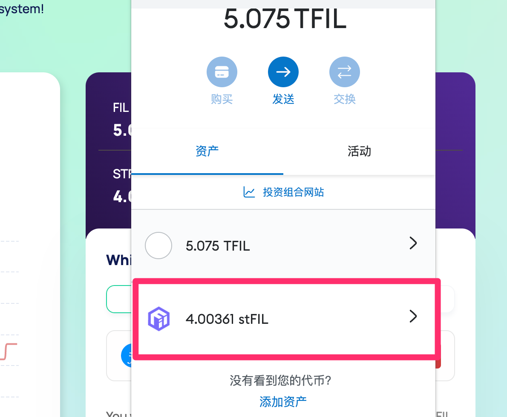

# Staking

Here, we provide a step-by-step guide on how to stake your Fil to earn maximum yield.

- Go to Stake page and select **STAKE** tab.
- Connect your wallet (such as MetaMask). Make sure your network is set to filecoin chain. 
    Click [here]( https://docs.filecoin.io/networks/mainnet/add-to-metamask/ ) if you do not have it set up.
- Specify the amount you want to stake
- Click **STAKE**

- After clicking STAKE, you should get a pop-up notification in your MetaMask to accept the transaction. 
    Click Confirm and wait for the transaction to be processed. 
- Once the transaction has gone through, you should automatically receive stFil in your wallet.

