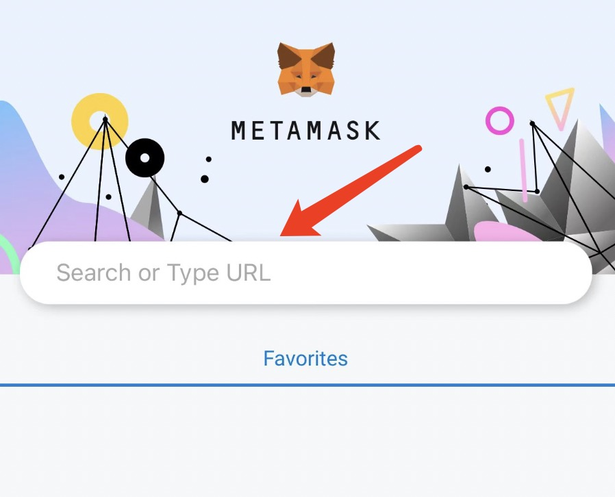
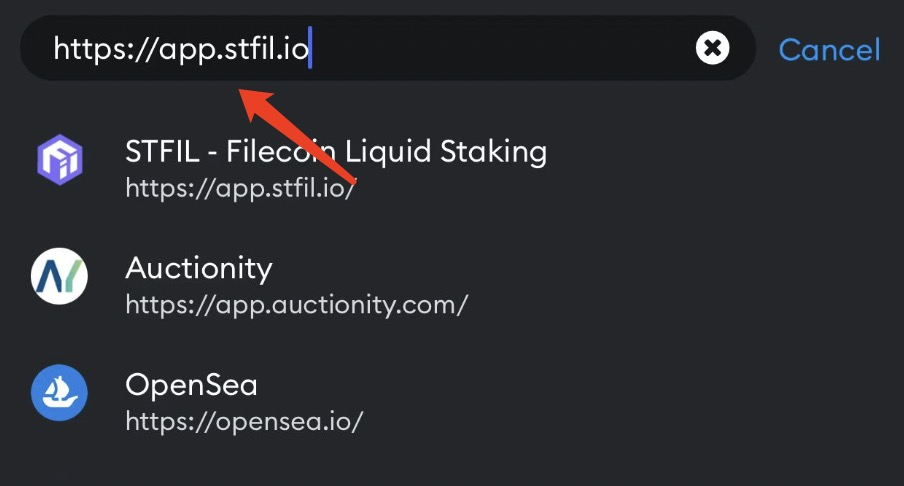
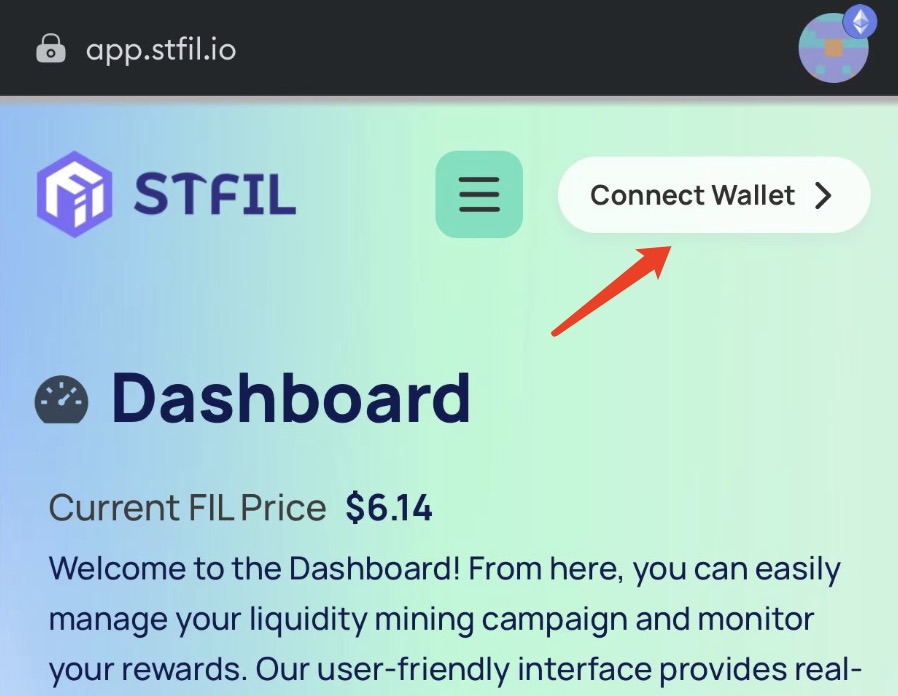
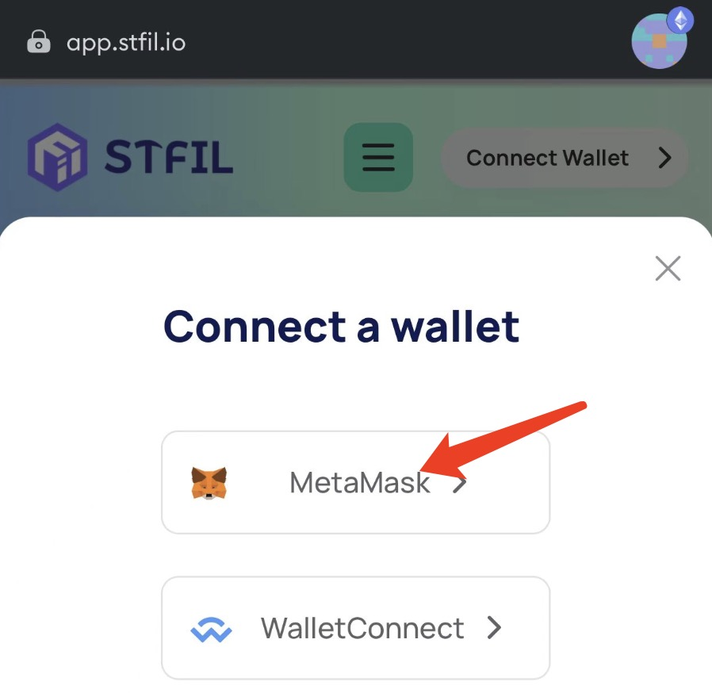
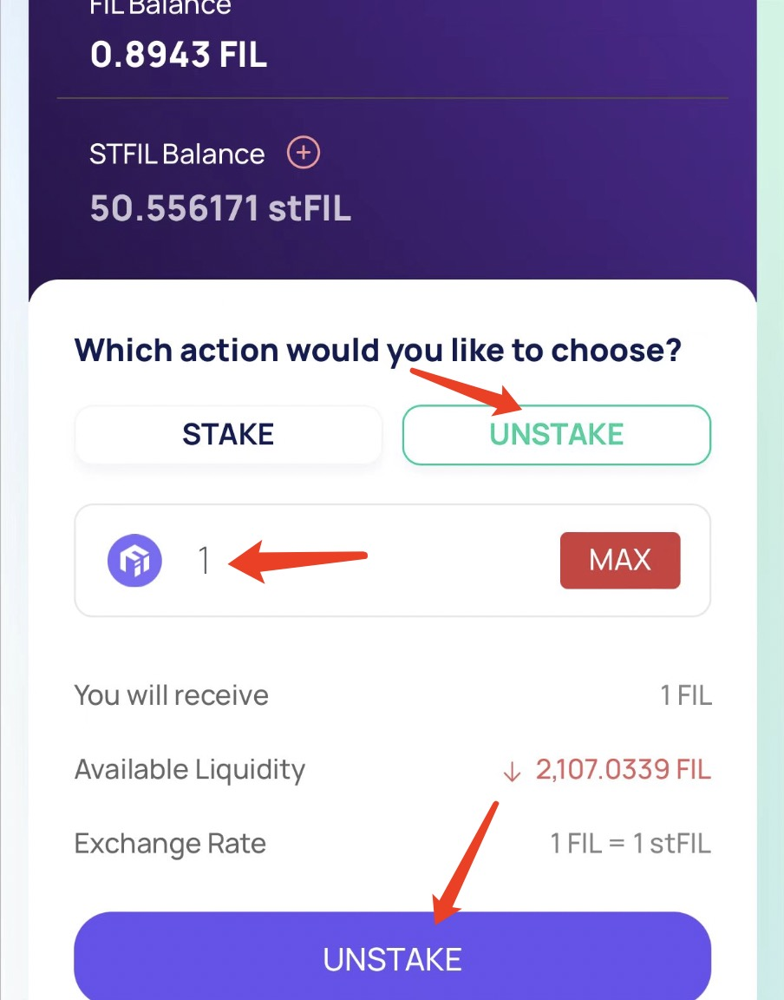
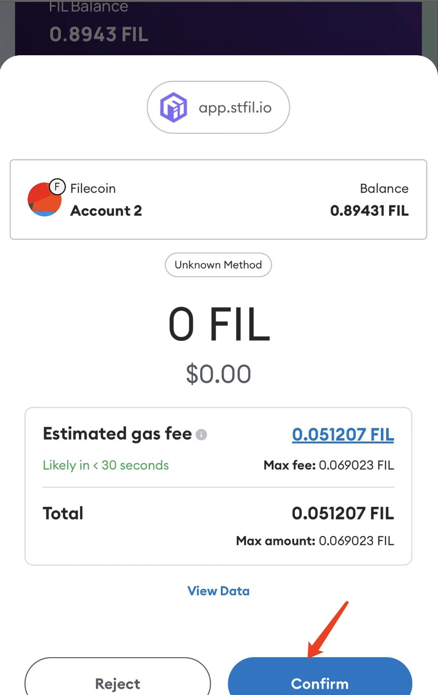
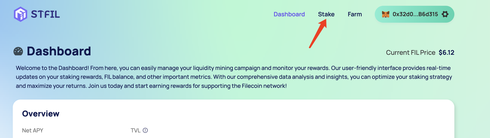

# UnStake

To Unstake your Fil from our vaults(redeem Fil from stFil), follow the steps below:

## How to unstake FIL

### Phone usage

Visit **https://app.stfil.io** in MetaMask browser

### PC-Chrome Browser Usage

Visit https://app.stfil.io in Chrome Browser

- Go to Stake page and select **UNSTAKE** tab.
- Connect your wallet (such as MetaMask). Make sure your network is set to filecoin chain.
  Click [here]( https://docs.filecoin.io/networks/mainnet/add-to-metamask/ ) if you do not have it set up.
- Specify the amount you want to unstake
- Click **UNSTAKE**

- After clicking UNSTAKE, You should get a pop-up notification in your MetaMask to accept the transaction.
- Wait for the transaction to be processed
- Once the transaction has gone through, within your wallet, you should receive Fil. 
