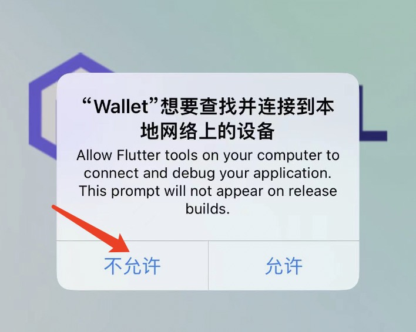

# Introduction

### What is STFIL Wallet？

STFIL Wallet, which provides professional wallet management and message signing for Filecoin storage providers. The STFIL wallet disables the network and is safe and reliable offline.

### Supported features

* Android & IOS - download and install
* Create wallet, import mnemonic words and import private key;
* Locally store and encrypt the private key
* Address list management
* Multiple wallet management (add, switch, etc.)
* Private key backup
* Information transmission via QR code on different devices
* Cold Wallet
* Support f1 (secp256k1) & f3 (BLS)
* Multilingual support (Chinese, English)

### Download 

[Android Apk Link](https://github.com/stfil-io/wallet/releases/download/v1.0.0/app-release.apk)

[IOS TestFlight Link](https://testflight.apple.com/join/7xieMNtx)

IOS application download and use. If there is a network request, directly select 'Disallow/不允许'. This application can be used without the need for networking.

