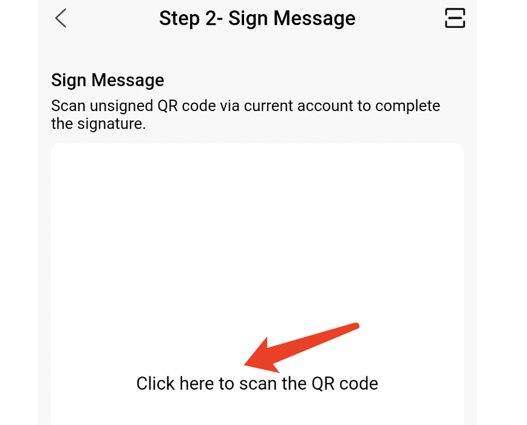

# Use & Platform Interaction

### How to use？

Storage providers can generate wallets with private keys and mnemonic words

#### Import private key

#### Set password

#### Account view

### How to interact with the platform？

The wallet and the platform can exchange messages by scanning QR codes

#### Sign message

### Generate signed message, QR code or paste message to the platform

### Scan the code or paste the message on the platform

