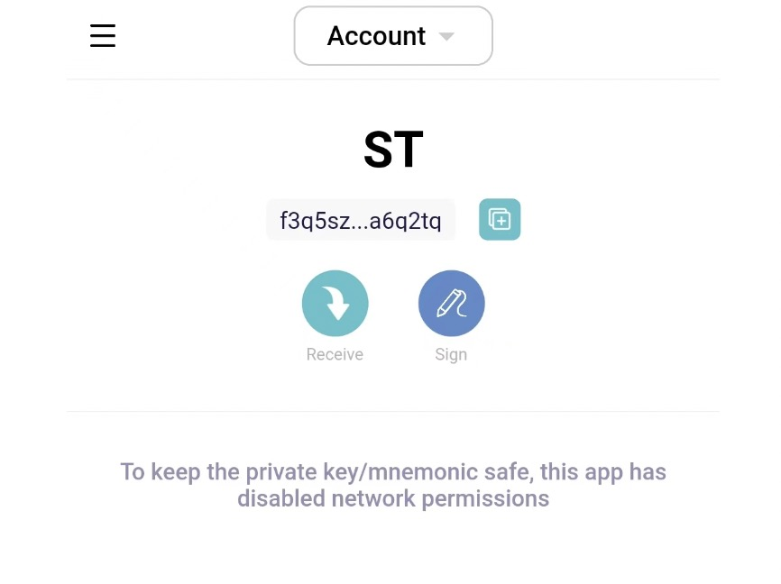

# Use & Platform Interaction

### How to use？

Storage providers can generate wallets with private keys and mnemonic words

#### 1. Import private key

#### 2. Set password

#### 3. Account view

### How to interact with the platform？

The wallet and the platform can exchange messages by scanning QR codes

#### Sign message

#### 1. Choose Sign

#### 2. Scan the QR code

### Generate signed message, QR code or paste message to the platform

### 1. QR code scanning

#### View QR code

#### Scan the QR code on the platform

### 2. Paste message way

#### Copy signed message

#### Paste to platform

