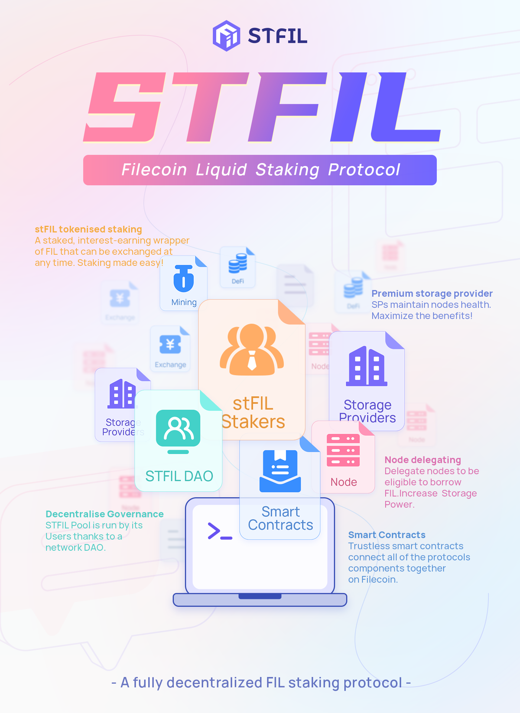

# 👋🏻 Overview

_**STFIL Protocol**_ aims to encourage more users to participate in the Filecoin network by launching a decentralized liquidity staking protocol to better connect token holders and Storage Providers. Theoretically, this should lower the barrier the entry for network participation and help Storage Providers ease their pledge collateral requirements.

_**STFIL Protocol**_ is not just meant to provide users with staking and loan services — realistically, protocol aims to provide an open platform for all community users who love, trust, and are optimistic about the future of Filecoin. Through collaboration between different user roles (providing FIL or providing capacity), the effective computing power, network quality and FIL of Filecoin could be greatly improved. We aim to create a win-win situation.

_**STFIL Protocol**_ allows users to obtain block rewards without locking assets and maintaining Storage Provider infrastructure by allowing Storage Providers to obtain more FIL in the protocol pool for pledge. Storage Providers also have a responsibility to maintain their nodes carefully while still onboarding data and capacity to the network, thus successfully obtaining block rewards. Additionally, STFIL will be directly managed by the STFIL DAO, and all upgrades and new features will not be controlled by any single team or entity. The STFIL protocol will always represent the core spirit of decentralized ecosystems.

The **_STFIL protocol_** mainly attracts two types of groups; those who want to obtain income without sacrificing liquidity performance participate in staking with tokenization and teams with high-quality hardware and operation and maintenance resources, hoping to provide services to obtain a higher return on investment;

For more information on these two groups that make up the protocol, we'd highly recommend [reading article one in our explainer series](https://medium.com/@contacts_5594/stfil-decentralized-liquidity-staking-protocol-for-filecoin-6c0b26621ead) that goes into great detail on how users can participate, be it via tokenised staking or running a node in the protocol.

The core premise behind a protocol is to ensure the network is not beholden to any one party.The _**STFIL protocol**_ brings together FIL holders and storage providers to share Filecoin block rewards. This is a win-win choice.

**_STFIL protocol_** expects every user to join, whether it is a FIL holder or an SP with operation and maintenance capabilities. Let us maintain a strong and stable distributed storage network together and share the block rewards brought by the Filecoin network.

