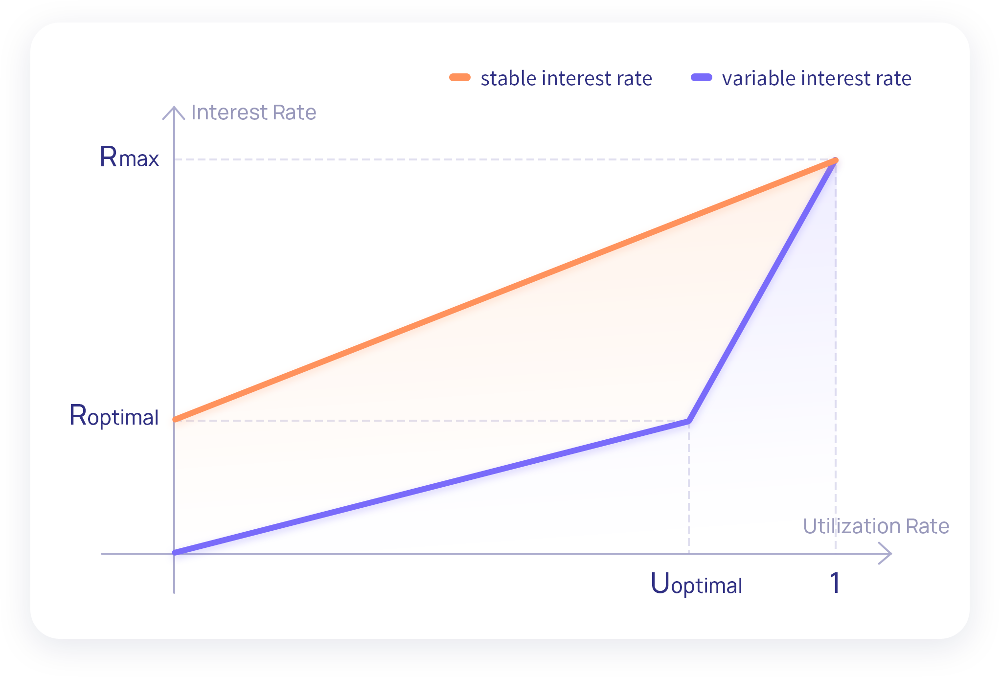

# 📌 Interest Rate Strategy

In the STFIL protocol, variable interest rates and stable interest rates are designed to meet the different needs of Storage Providers. The interest rate model can make STFIL users’ stake/loan interest change with market supply and demand. When the demand for loans increases, the stake interest rate and loan interest will rise to encourage new users to participate in the stake; when the demand for loans decreases , the stake interest rate and loan interest will encourage Storage Providers actively borrowing for pledge.

