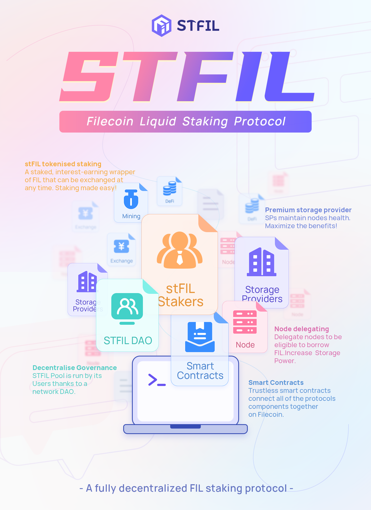

# 👋🏻STFIL Document Hub

**STFIL** is a first of its kind FIL Stake Protocol, designed to be community owned, decentralised, trustless and compatible with staking in FVM.

The **STFIL protocol** mainly attracts two types of groups:

1. _**Assets**_: Token holders who want to obtain income without sacrificing liquidity performance participate in staking with tokenization;
2. _**SP**_: A team with high-quality hardware and operation and maintenance resources, hoping to provide services to obtain a higher return on investment;

**STFIL** expects every user to join, whether it is a FIL holder or an SP with operation and maintenance capabilities. Let us maintain a strong and stable distributed storage network together and share the block rewards brought by the Filecoin network.

