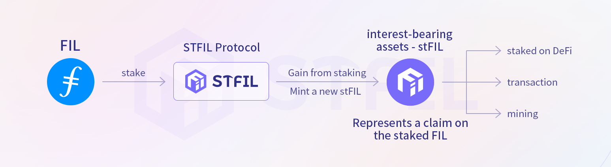
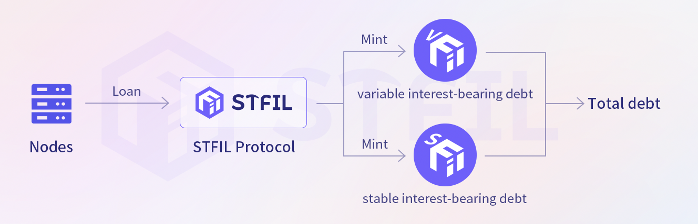

# 🎉 Liquidity protocol

### Protocol Overview
_**STFIL Protocol**_ aims to encourage more users to participate in the Filecoin network by launching a decentralized liquidity staking protocol to better connect token holders and Storage Providers. Theoretically, this should lower the barrier the entry for network participation and help Storage Providers ease their pledge collateral requirements.

_**STFIL Protocol**_ is not just meant to provide users with staking and loan services — realistically, protocol aims to provide an open platform for all community users who love, trust, and are optimistic about the future of Filecoin. Through collaboration between different user roles (providing FIL or providing capacity), the effective computing power, network quality and FIL of Filecoin could be greatly improved. We aim to create a win-win situation.

_**STFIL Protocol**_ allows users to obtain block rewards without locking assets and maintaining Storage Provider infrastructure by allowing Storage Providers to obtain more FIL in the protocol pool for pledge. Storage Providers also have a responsibility to maintain their nodes carefully while still onboarding data and capacity to the network, thus successfully obtaining block rewards. Additionally, STFIL will be directly managed by the STFIL DAO, and all upgrades and new features will not be controlled by any single team or entity. The STFIL protocol will always represent the core spirit of decentralized ecosystems.
### Protocol User

The _**STFIL protocol**_ mainly attracts two types of user groups：

⚒︎ _**Investors**_: Token holders who want to earn income without directly participating in pledging via running a storage provider operation;

⚒︎︎ **_Storage Providers_**：Teams with high-quality hardware and operation and maintenance resources hope to access FIL for pledge collateral for onboarding data and capacity to the Filecoin Network；

###  SP Onboarding

**_STFIL Protocol_** requires that storage providers must already run nodes before lending; assets from the current node should be used as collateral to obtain loan qualifications from the protocol. The protocol strictly restricts the borrowed FIL to only be used for sector pledge commitments. Any storage provider can join the agreement and qualify for a loan under this premise.

If the storage provider wants to obtain a higher loan amount, it needs to improve KYC and submit it to STFIL DAO for review. Audits include the following aspects:

➱ The operation and maintenance capabilities of storage providers, especially large storage providers.

➱ The node’s historical performance.

➱ Geographical and Jurisdictional Distribution.

➱ How keys and other security aspects are managed.

➱ ...

Storage providers can obtain different maximum loan leverage by delegating Owner/Beneficiary addresses to the DAO.

### Tokenization of staked assets.

**1.Staking Tokenization**

The **_STFIL Protocol_** will mint stFIL tokens, which are derivative tokens representing stake FIL; it allows holders (assets) to stake their FIL assets into smart contracts to mint a 1:1 stake token stFIL, This is a derivative token based on EIP-2612 (an extension of ERC-20). It represents the right to claim staked FIL. And stFIL does not need to be locked! After users hold stFIL, no matter where they are obtained from, stFIL will accumulate staking rewards.

**2.Debt tokenization**

Similar to minting stFIL, the **_STFIL Protocol_**’s debts to storage providers are also tokenized. Storage providers can choose different loan strategies according to their actual needs and market judgments. Whether you choose variable rate debt or stable rate debt, the corresponding ERC-20 tokens vdFIL and sdFIL will be minted for bookkeeping.

