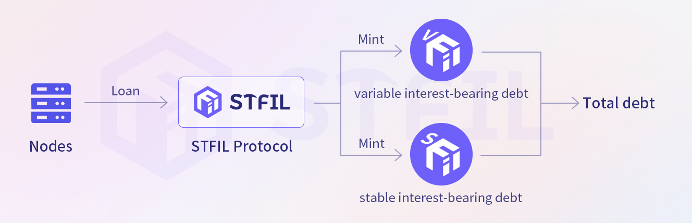

#  Leverage

Storage providers can obtain different maximum loan leverage by delegating Owner/Beneficiary addresses to the Smart contract.

Each node has a default maximum loan leverage  based on their chosen role as Owner or Beneficiary to delegate, with a minimum value of 1, which represents a loan amount of 0. They can obtain a larger maximum loan leverage by submitting more detailed KYC and passing the STFIL DAO's audit.

1.  Delegate beneficiary address: After onboarding, you can get **1.5** times leverage. After completing KYC, you can get a maximum leverage of **2.0** times.

2.  Delegated owner address：After onboarding, you can get **2.0** times leverage. After completing KYC, you can get a maximum leverage of **3.0** times.

### Debt tokenization

Similar to minting stFIL, the **_STFIL Protocol_**’s debts to storage providers are also tokenized. Storage providers can choose different loan strategies according to their actual needs and market judgments. Whether you choose variable rate debt or stable rate debt, the corresponding ERC-20 tokens vdFIL and sdFIL will be minted for bookkeeping.

