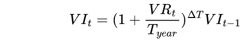
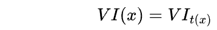
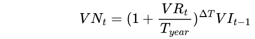
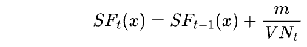
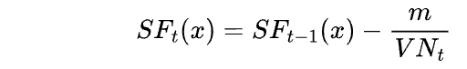
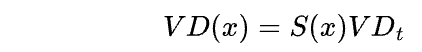

# Variable Rate Debt

The variable-rate model of STFIL can provide a more fair and transparent market pricing
mechanism, enabling market participants to manage their funds more flexibly and gain greater
profits from market fluctuations.   

To implement this strategy, the following concepts have been introduced into the
variable-rate debt of the STFIL protocol:

* _**VIt**_, Interest-bearing index for cumulative variable-rate loan.
The interest accumulated on the variable-rate debt _**VB**_ borrowed at rate _**VR**_ within time _**∆T**_
is updated whenever there is a stake, unstake, borrow, repay , or liquidate event.

* _**VI(x)**_ , Interest-bearing index for a user's variable-rate loan.
The variable-rate loan index for a specific storage provider x , stored at the time of opening
 a variable loan position.

* _**VNt**_, Standardized variable-rate (accruing) debt.

_**St(x)**_ is the scaling factor for user x at time t , m is the transaction amount, and _**VNt**_ is the
standardized variable-rate debt:  
* _**Borrows**_. When storage provider x borrows an amount m from the protocol, the scaling factor will be updated.

* _**Repays**_. When storage provider x repays or defaults on an amount m , the scaling factor will be updated.

At any given moment, the total variable-rate debt balance for storage provider x can be
expressed as: 

