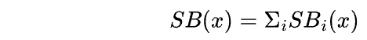
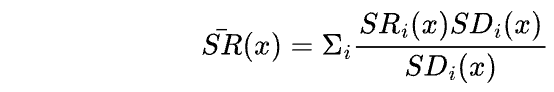
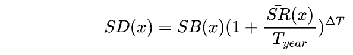
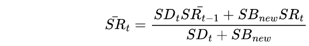
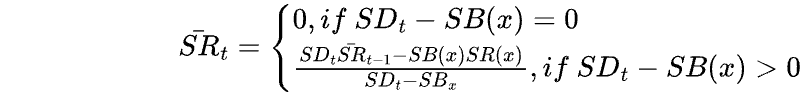

# Stable Rate Debt

STFIL also offers a stable-interest-rate model. The interest rate in this model remains fixed
over a fixed borrowing period and is not affected by market supply and demand. The
stable-interest-rate model is usually suitable for storage providers who want to obtain
predictable returns over a specific period of time. For example, storage providers who want to
pay fixed costs over a certain period of time.     

It should be noted that since the stable-interest-rate does not change with market
fluctuations during the fixed borrowing period, the fixed interest rate is always higher than the
variable-interest-rate at any time. Additionally, the stable-interest-rate may cause market
imbalance because it cannot be adjusted according to market supply and demand.    

Overall, STFIL's stable-interest-rate model can provide more stable returns, but may limit
market flexibility in some cases. Storage providers should choose the appropriate interest rate
model according to their own needs.  

For the stable-interest-rate model, the following concepts are introduced:

* _**SB(x)**_, The total amount of storage provider x's stable rate loan.
The total amount of stable rate loans for the same storage provider x: 

* _**SR(x)**_, Weighted average of storage provider x's stable-interest-rate.
The total amount of i stable loans and rates for the same storage provider x is calculated as: 

At any time, the total stable interest rate debt balance for storage provider x can be written as:

Overall stable-interest-rate._**SRt**_:
* _**Brorrows**_. When initiating a stable loan with a loan amount of _**SBnew**_ at an interest rate of _**SRt**_ :

* _**Repays**_. When the storage provider x repays a stable loan with an amount of_** SBi(x)**_ (with interest rate of _**SRi(x)**_ ):

