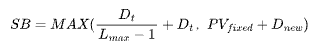

#  Safety Buffer

In order to ensure that all loans obtained by storage providers are used for sector pledges, a safety buffer index (SB) is introduced. If the node of the storage provider has fixed assets _PVfixed_ (excluding the available balance), when the node obtains a loan amount of _Dnew_:

 （_Lmax_  is the Maximum loan leverage）

When _PVt_ <= _SB_ ,storage providers' withdrawals will be restricted, and the generated earnings must first be used to repay the loan and interest. Withdrawals will only be permitted until _PVt_ > _SB_.
