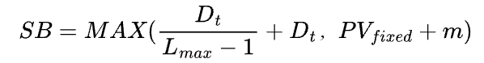

#  Safety Buffer

In order to ensure that all loans obtained by storage providers are used for sector pledges, a
safety buffer index is introduced. If the node of the storage provider has fixed assets _**PVfixed**_
(excluding the available balance), when the node obtains a loan amount of _**Dnew**_ :

* _**Lmax**_ , Maximum loan leverage. Each node has a default maximum loan leverage based
on their chosen role as Owner or Beneficiary to delegate, with a minimum value of 1,
which represents a loan amount of 0. 

When _**PVt <= SB**_ ,storage providers' withdrawals will be restricted, and the generated earnings must first be used to repay the loan and interest. Withdrawals will only be permitted until _**PVt > SB**_.
