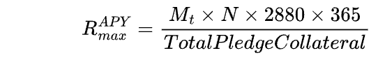
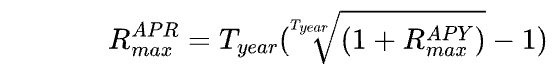
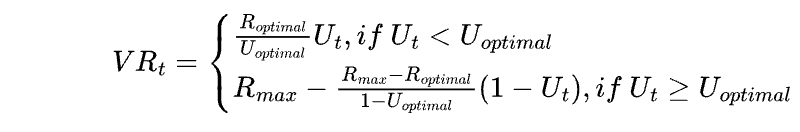
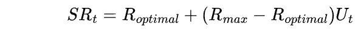
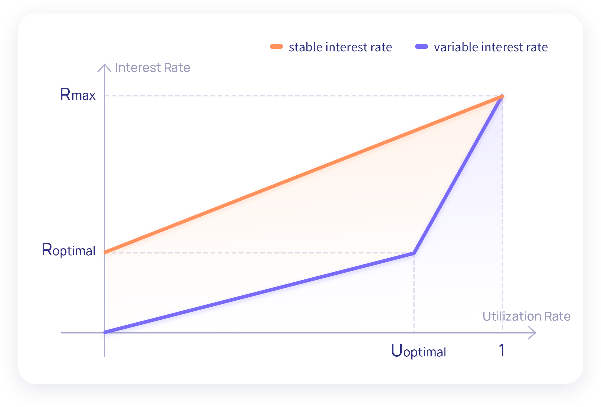

# Interest Rate 

In the STFIL ,the interest rate model can make STFIL users’ stake/loan interest change
with market supply and demand. When the demand for loans increases, the stake interest rate
and loan interest will rise to encourage new users to participate in the stake; when the demand
for loans decreases , the stake interest rate and loan interest will encourage Storage Providers
actively borrowing for pledge.     
The crucial indicator determining changes in interest rates is the utilization rate . When
the utilization rate reaches a predetermined optimal utilization rate, the loan interest rates will
begin to rise exponentially when borrowing again. High interest rates will attract more users to
stake and storage providers to repay loans, which effectively avoiding liquidity problems that
could lead to situations where users are unable to redeem FIL in a timely manner.

In the interest model of the protocol, we introduce the following concept:

* _**RAPRmax**_, Maximum Loan rate. It is also the rate when _**Ut = 1**_ . At this time,the total block
rewards storage providers obtain are used solely to pay off loan interest, which means
storage providers never experience negative yields at any point. The value of _**RAPRmax**_
determined by the current block rewards distributed by Filecoin and the overall network
collateral：

_**Mt**_ represent the block rewards at time _**t**_ ; _**N**_ represents the average number block of per Tipsets over a period of time.

* _**Uoptimal**_, Optimum utilization of funds。Utilization targeted at asset reserves. When
utilization exceeds that, the loan interest rate will go up dramatically.
* _**Roptimal**_, Optimum loan interest rate。It is the interest rate when _**Ut = Uoptimal**_.
* _**VRt**_, variable loan interest rate at time _**t**_.

when _**Ut < Uoptimal**_ ，the changes of interest rate is determined by both Uoptimal and Roptimal
.At this time, the slope of the interest rate is low and the growth rate is relatively slow. When
_**Ut ≥ Uoptimal**_, At this time, the slope of the interest rate is very high, which will make the
interest rate quickly approach _**Rmax**_.

* _**SRt**_, Stable loan interest rate.

