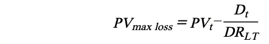
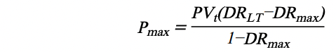

#  Liquidation

Once the node receives the funding, storage provider is obligated to maintain the stability
of the node. Therefore, the storage provider should first bear the fines and losses of the nodes
due to accidents.    
In order to avoid major accidents (such as the accidental loss of node storage) that may
cause the storage provider's mortgage assets to be unable to bear all losses and lose the
motivation to recover the remaining residual value (which may cause greater losses to the
protocol), the protocol introduces the following measures to encourage storage providers to
actively maintain the node at all times:

* _**DRLT**_ , Liquidation threshold of asset-liability ratio. Anytime: _**DRLT > DRmax**_

STFIL protocol intends to liquidate the debt of nodes with _**DRt > DRLT**_ , and the STFIL
protocol allows anyone to become a liquidator. The presence of liquidators helps to promote the
stability of the STFIL protocol as they can ensure that the liquidated loans are properly handled
and reduce the protocol's risk exposure. Users can increase their participation and earn profits
by becoming liquidators.   
The node's loss bearing is divided into two stages:

* Phase 1, all borne by the storage provider, covering a small amount of loss in the
maintenance process of the node: 

* Phase 2, the ratio of the total debt of the storage provider's node to the total asset of
the node is always equal to _**DRLT**_ . Therefore, the storage provider still has assets
belonging to themselves on the nodes at any time, which increases their willingness to
recover the nodes. All losses will be shared in equal proportions, and the impairment
of the pool will be borne by the [risk reserve fund](../risk_reserves) first, followed by all users who hold stFIL. For each user, a small
amount of loss is almost negligible    

In order to further reduce the risk of the pool, at the same time as the liquidation, the
available balance of the storage provider will be used to repay the loan. Repay until _**DRt = DRmax**_
, then the maximum repayment amount is:

The storage provider can only redeem the pledged nodes and regain full ownership of the
nodes after all debts have been repaid. 